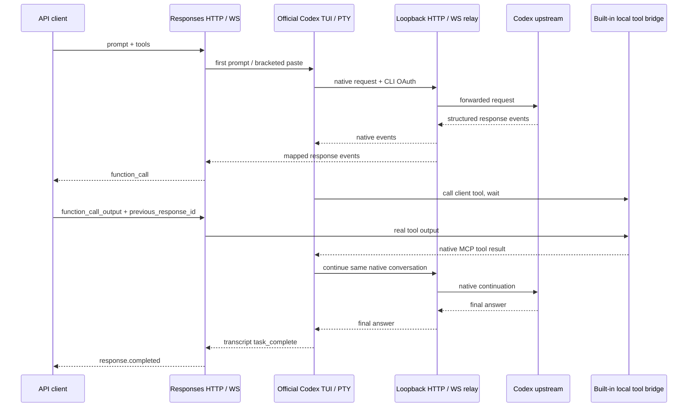

# Codex TUI gateway

## Process and protocol ownership

`Sessions` maintains one persistent TUI per conversation, one shared OAuth account,
and a single active API inference. This is conversation state, not an account pool.
The official CLI owns authentication, native instructions, transcript persistence
and its conversation history. `openai_base_url` sends native HTTP and WebSocket
traffic through a loopback proxy. Upstream URLs and credentials are not taken from
public request fields. No application patch, TLS certificate installation or
third-party MCP service is required.

Public response IDs map to gateway conversations; upstream response IDs remain
inside the native connection. Warmups and title/background traffic are forwarded
but do not become API output. Main requests are correlated with the exact submitted
user message or a known native response/tool call ID. Both `tools` and the newer
`input.additional_tools` schema are handled. Completed output is reconstructed
from item events when the native `response.completed.output` array is empty.

Only the session's client-tool namespace is offered to the upstream. Codex's
`features.code_mode.direct_only_tool_namespaces` keeps that namespace directly
callable even for models that default to Code Mode. Native calls retain their
call IDs; the public name/namespace is mapped back to the client's declaration.
Custom tools use a single string `input` field in their internal MCP schema.

The built-in tool bridge is a stdio child process with an ephemeral, authenticated
loopback endpoint. Its approval mode authorizes forwarding a call to the client;
it does not execute a client shell command on the gateway. The client retains its
own execution/approval policy. Arbitrary client tools are not marked read-only.
Unknown native tools fail the session before delivery to the TUI.

## Turn boundaries and recovery

The Jinn-derived transcript tailer combines filesystem watches and polling, handles
partial UTF-8/JSONL writes, and requires a matching `task_started` before accepting
`task_complete` or `turn_aborted`. Transcript discovery checks the unique gateway
working directory, preventing attachment to another Codex process's rollout.

The first prompt is supplied as a native CLI argument, so startup does not depend
on terminal text or a fixed sleep. Later prompts use bracketed paste; the short
paste/Enter separation is terminal input framing, not a turn-completion detector.
Native tool waits remain part of the same TUI turn. The API can finish a tool-call
response while that native turn is still waiting; the final text response waits
for the matching transcript completion marker.

Clean idle sessions checkpoint their native session ID and last public response ID.
After gateway restart, an eligible request launches `codex resume` with that ID.
Active inference and outstanding client tool calls are excluded from recovery:
replaying either could duplicate external work. Full-history matching is in-memory;
after restart, use the last `previous_response_id`. Session expiration is explicit.

## Imported code

- CPA-Manager-Plus: React UI primitives and theme sources, adapted application pages.
- Jinn: transcript tailer and Codex turn marker parser; warm-process lifecycle and
  `resume` informed the gateway lifecycle. Its Claude request classifier was not
  copied because Codex also sends main requests with no top-level tools.

See [UPSTREAM.md](../UPSTREAM.md) for pinned commits and retained licenses.
